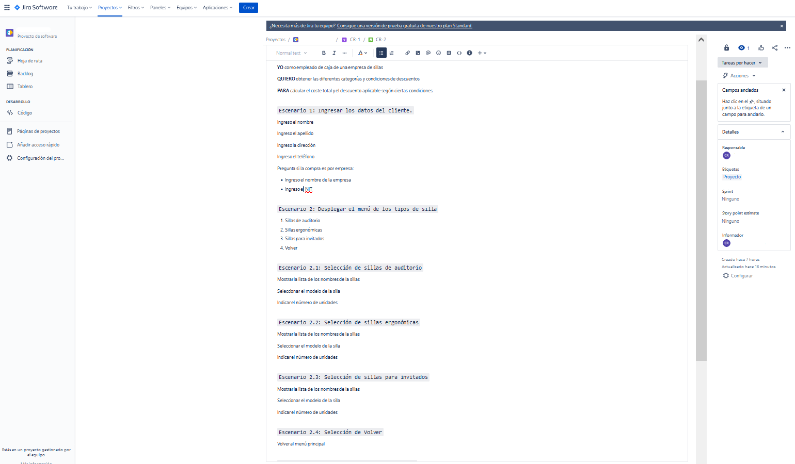
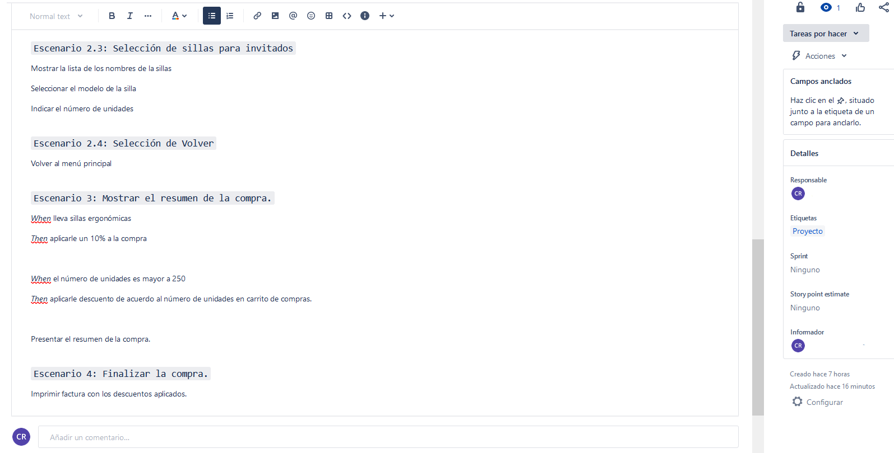
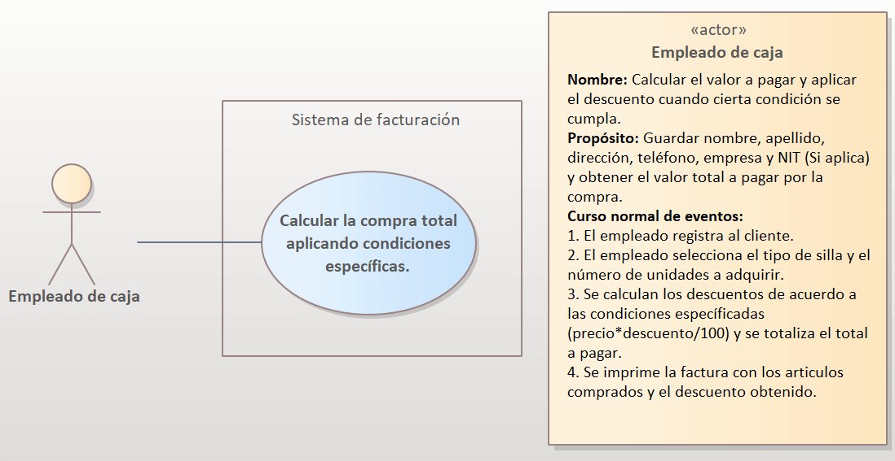
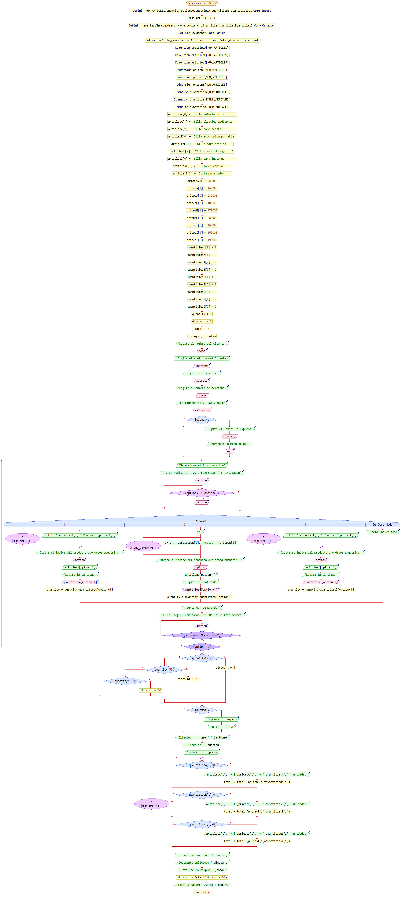
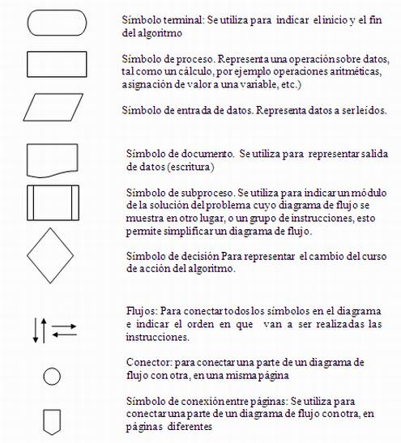
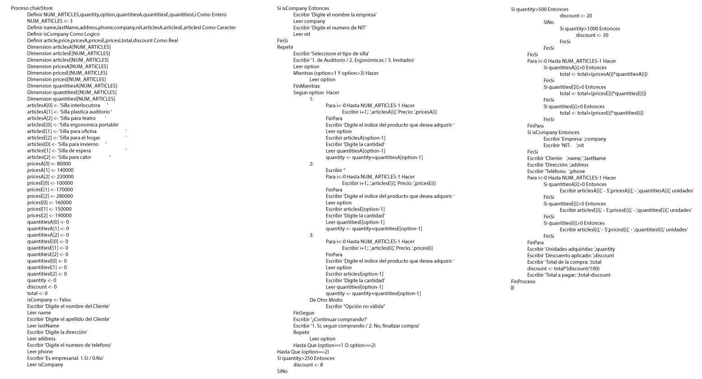

# Repaso programación 

## Documentación programa de venta de sillas

 

### Contenido
---

- [Repaso programación](#repaso-programación)
  - [Documentación programa de venta de sillas](#documentación-programa-de-venta-de-sillas)
    - [Contenido](#contenido)
  - [1. Enunciado](#1-enunciado)
  - [2. Análisis del problema](#2-análisis-del-problema)
  - [3. Representación de las funcionalidades del problema.](#3-representación-de-las-funcionalidades-del-problema)
  - [4. Diseñando el diagrama de flujo](#4-diseñando-el-diagrama-de-flujo)
  - [5. Implementando en pseudocódigo](#5-implementando-en-pseudocódigo)

 
 
 
 
 

## 1. Enunciado
---

Se necesita desarrollar un programa que permita aplicar descuentos a la compra de sillas de acuerdo a ciertas condiciones específicas. El programa será utilizado por una tienda de sillas que vende 3 tipos de sillas: sillas de auditorio, sillas ergonómicas y sillas para invitados.

El programa deberá aplicar a la compra realizada las siguientes condiciones:

- Por la compra de 100 unidades se aplicara un descuento del 8%.
- Por la compra de 350 unidades se aplicara un descuento del 20%.
- Por la compra de 800 unidades se aplicara un descuento del 30%.

Adicionalmente, el programa deberá solicitar los datos del comprador, incluyendo su nombre, apellidos, dirección, teléfono, empresa(Si este aplica) y su número de NIT.

 
 
 

## 2. Análisis del problema
---

Para análizar el problema utilizaremos [**Jira**](https://www.atlassian.com/es/software/jira) y la técnica utilizada en la gestión de proyectos de desarrollo de software "**Historia de Usuario**" que nos permitirá describir de manera detallada el comportamiento de nuestro sistema desde el punto de vista de nuestro cliente final.

    
<b>💡 ¿Que es historia de Usuario?</b>

    

> Es una técnica utilizada en el desarrollo de software para describir las necesidades y requerimientos del **usuario final**. Una historia de usuario es una descripción corta y simple de una funcionalidad o característica deseada por el usuario y que se desea implementar en el software. 
> 
>> 

>>    
<b>💡 Given-When-Then </b>

>>    

>>
>> **Given:** Describe el contexto o estado inicial necesario para que la funcionalidad descrita en la historia de usuario tenga lugar.
>>
>> **When:** Describe la acción o evento que debe ocurrir para que se active la funcionalidad descrita en la historia de usuario.
>>
>> **Then:** Describe el resultado esperado de la funcionalidad descrita en la historia de usuario.
>>
>> 

>> 

>
> Esto permite a los desarrolladores implementar la funcionalidad de manera precisa y asegurarse de que la funcionalidad cumpla con las expectativas del usuario.
>
> 

> 

 
 
 

## 3. Representación de las funcionalidades del problema.
---

Para representar las funcionalidades del problema usaremos el [Diagrama de casos de uso](https://diagramasuml.com/casos-de-uso/) y lo diseñaremos visualmente.

 

    
<b>💡 ¿Qué es un diagrama de caso de uso? UML </b>

    

>! En un diagrama de caso de uso, se describe cómo los usuarios interactúan con el sistema para realizar tareas específicas y qué respuestas ofrece el sistema a estas interacciones.
>
>El diagrama de caso de uso es útil para entender cómo los usuarios interactúan con el sistema y cuáles son las funcionalidades más importantes que deben ser incluidas en el sistema.

 
 
 

## 4. Diseñando el diagrama de flujo
---

Para diseñar el diagrama de flujo utilizaremos la herramienta [PSeInt](https://pseint.sourceforge.net/) para representar el algoritmo o flujo de trabajo de manera visual y sencilla de entender.

    
<b>💡 ¿Qué es un diagrama de flujo? </b>

    

>! Un diagrama de flujo es una representación gráfica de un proceso o algoritmo en el cual se muestran las diferentes etapas, decisiones y acciones que componen dicho proceso. Es una herramienta de diagramación utilizada en programación, análisis de procesos y otras disciplinas para visualizar y documentar el flujo de trabajo.
>
>Un diagram de flujo se compone de un inicio, proceso, decisiones, conectores, flechas y un final.
>
>>
>
> Al utilizar un diagrama de flujo, se puede visualizar de manera clara y concisa el proceso o algoritmo completo, lo que facilita la identificación de errores o posibles mejoras. 

 
 
 

## 5. Implementando en pseudocódigo
---

    
<b>💡 ¿Qué es un pseudocódigo? </b>

    

> El pseudocódigo es un lenguaje de programación informal que se utiliza para describir un algoritmo de programación. Es una forma de escribir código que es fácil de entender por los programadores, sin la necesidad de conocer un lenguaje de programación específico. 
>
>  El objetivo del pseudocódigo es describir de manera clara y concisa el proceso lógico que sigue un programa sin preocuparse por la sintaxis o detalles específicos del lenguaje de programación.
>
> El pseudocódigo puede ser utilizado como una herramienta de diseño y planificación antes de comenzar la implementación de un programa en un lenguaje de programación real. Además, el pseudocódigo puede ser utilizado para documentar el proceso y como una herramienta de comunicación entre diferentes miembros del equipo de desarrollo.

