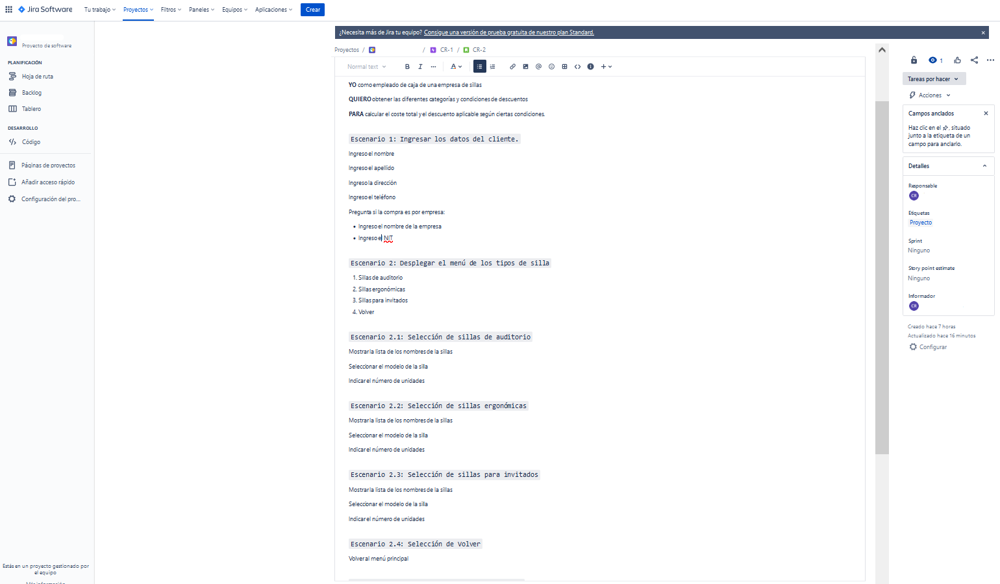
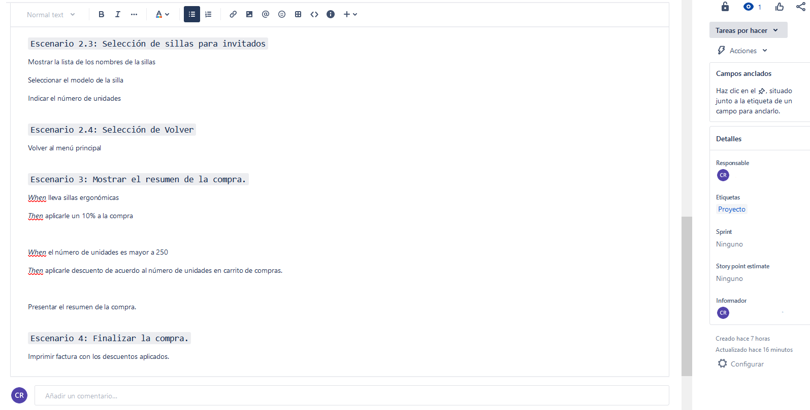
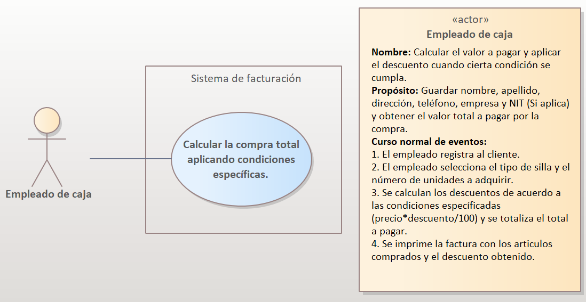
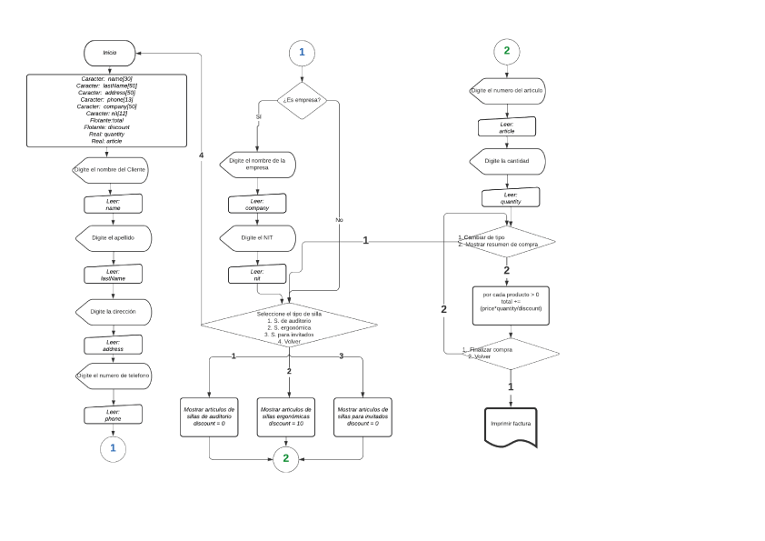

# Repaso programación 

## Documentación programa de venta de sillas

 

### Contenido

1. Enunciado del problema.
2. Análisis del problema.
3. Representación de las funcionalidades del problema.
4. Diseñando el diagrama de flujo. 
5. Implementando el seudocódigo.

 
 
 
 
 

## 1. Enunciado

Se necesita desarrollar un programa que permita aplicar descuentos a la compra de sillas de acuerdo a ciertas condiciones específicas. El programa será utilizado por una tienda de sillas que vende 3 tipos de sillas: sillas de auditorio, sillas ergonómicas y sillas para invitados.

El programa deberá aplicar a la compra realizada las siguientes condiciones:

- Las sillas ergonómicas tendran un 10% de descuento.
- Por la compra de 250 unidades se aplicara un descuento del 8%.
- Por la compra de 500 unidades se aplicara un descuento del 20%.
- Por la compra de 1000 unidades se aplicara un descuento del 30%.

Adicionalmente, el programa deberá solicitar los datos del comprador, incluyendo su nombre, apellidos, dirección, teléfono, empresa(Si este aplica) y su número de NIT.

 
 
 

## 2. Análisis del problema

Para análizar el problema utilizaremos [**Jira**](https://www.atlassian.com/es/software/jira) y la técnica utilizada en la gestión de proyectos de desarrollo de software "**Historia de Usuario**" que nos permitirá describir de manera detallada el comportamiento de nuestro sistema desde el punto de vista de nuestro cliente final.

 
 
 

## 3. Representación de las funcionalidades del problema.

Para representar las funcionalidades del problema usaremos el [Diagrama de casos de uso](https://diagramasuml.com/casos-de-uso/) y lo diseñaremos visualmente. Utilice el software con licencia de prueba [Enterprise Architect](https://sparxsystems.com/).

 
 
 

## 4. Diseñando el diagrama de flujo

Para diseñar el diagrama de flujo utilizaremos la herramienta online [Lucidchart](https://lucid.co/) para representar el algoritmo, proceso o flujo de trabajo de manera visual y sencilla de entender.

 
 
 

## 5. Implementando en seudocódigo

